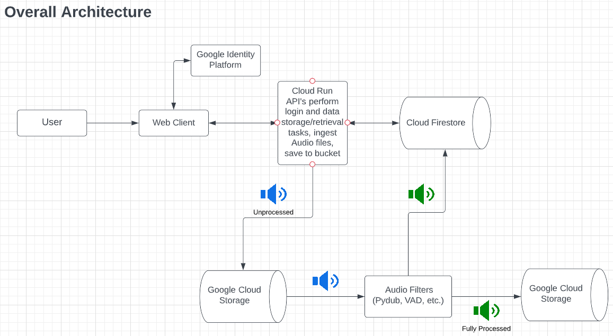

# project-bch-als-msg-banking

Boston Children's Hospital ALS Message Banking Project (Double Dipping Audio Editor)

Speech impairment is common in patients with ALS. The ALS Message Banking Project aims to preserve their voice and assist them with their needs.
The platform allows the user to login to their own dashboard where they can upload and retrieve audio files securely. The project currently supports three implemented audio processing features (deadspace trimming, file splitting, and audio normalization). The ultimate goal is to have several fully functional filters to enhance sound quality so parts of the audio clips can be reused to produce a new "voice" for the user.

## Technical Architectures




- Frontend:
  - React.js
- Backend:
  - Flask Python
  - Audio Processing: 
    - PyDub Library
    - WebRTC VAD Library
- Database:
  - Firestore to store user information + file names
  - Google Cloud Storage for audio files

## Running/Deploying the Application

Follow the steps below to run and deploy the application

## Frontend

`cd client`

### Run Frontend Locally

- In client/src/components, update line 1 in settings.js so that module.exports equals 'http://localhost:8080' (change it back to 'https://api-dev-z2scpwkwva-uc.a.run.app' when pushing/deploying)

`npm install`

`npm start`

### To Deploy Frontend

Push to `main` or create a PR to main to see the deployed website. CI/CD deploys to Firebase Hosting. The frontend is accessible at [als-message-banking.web.app/](https://als-message-banking.web.app/) right now.

## Backend

`cd backend`

### Run Backend Locally

- Setup GOOGLE_APPLICATION_CREDENTIALS as described here - <https://cloud.google.com/docs/authentication/getting-started>
- Place the generated JSON key into the backend folder and rename it to 'serviceaccount.json"

```bash
docker build -t als-backend .
docker run --env GOOGLE_APPLICATION_CREDENTIALS='./serviceaccount.json' -p 8080:8080 als-backend
```
### Note
- Modify the Cloud Firestore DB rules, as requests are set to reject after a certain date

### To Deploy Backend

Backend is deployed to GCP. After authenticating docker to push to the private docker repository, run the following commands to deploy the API.

```bash
docker build -t us-docker.pkg.dev/als-message-banking/docker/api-dev:latest .
docker push us-docker.pkg.dev/als-message-banking/docker/api-dev:latest
gcloud run deploy api-dev \
--image=us-docker.pkg.dev/als-message-banking/docker/api-dev:latest \
--platform=managed \
--region=us-central1 \
--project=als-message-banking
```

## Known Bugs and Future Steps

### Issues

[Click Here](https://github.com/BU-Spark/se-bch-als-msg-banking/issues) to view the list of bugs and feature suggestions.

### Next Steps

- Develop additional audio processing features: 
  - Background noise reduction
  - Improve the clarity of slurred subject voice
- Other features: 
  - Folder layout in processed files pages
  - User is able to delete processed files
  - User input in trimming/splitting process

### Resources Tried/General Notes
- Deadspace removal/splitter uses VAD which depends on the clarity of the patient's voice in the audio file
- Attempted to use python's noisereduce library for background noise, but the library distorsts the voice in the audio file, which affects the dead space removal/splitter function. 
- Dolby API has superior background noise reduction capabilities, but requires funding. Client is deciding whether they would like to use it or not.
