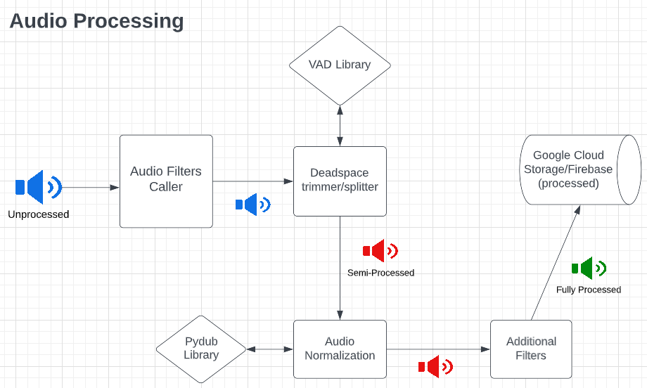

# project-bch-als-msg-banking

Boston Children's Hospital ALS Message Banking Project (Double Dipping Audio Editor)

Speech impairment is common in patients with ALS. The ALS Message Banking Project aims to preserve their voice and assist them with their needs.
The platform allows the user to login to their own dashboard where they can upload and retrieve audio files securely. The project currently supports three implemented audio processing features (deadspace trimming, file splitting, and audio normalization). The ultimate goal is to have several fully functional filters to enhance sound quality so parts of the audio clips can be reused to produce a new "voice" for the user.

## Technical Architectures




- Frontend:
  - React.js
- Backend:
  - Flask Python
  - Audio Processing: 
    - PyDub Library
    - WebRTC VAD Library
- Database:
  - Firestore to store user information + file names
  - Google Cloud Storage for audio files

## Running/Deploying the Application

Follow the steps below to run and deploy the application

## Frontend

`cd client`

### Run Frontend Locally

- In client/src/components, update line 1 in settings.js so that module.exports equals 'http://localhost:8080' (change it back to 'https://api-dev-z2scpwkwva-uc.a.run.app' when pushing/deploying)

`npm install`

`npm start`

### To Deploy Frontend

Push to `main` or create a PR to main to see the deployed website. CI/CD deploys to Firebase Hosting. The frontend is accessible at [als-message-banking.web.app/](https://als-message-banking.web.app/) right now.

## Backend

`cd backend`

### Run Backend Locally

- Setup GOOGLE_APPLICATION_CREDENTIALS as described here - <https://cloud.google.com/docs/authentication/getting-started>
- Place the generated JSON key into the backend folder and rename it to 'serviceaccount.json"

```bash
docker build -t als-backend .
docker run --env GOOGLE_APPLICATION_CREDENTIALS='./serviceaccount.json' -p 8080:8080 als-backend
```
### Note
- Modify the Cloud Firestore DB rules, as requests are set to reject after a certain date

### To Deploy Backend

- Note: Incomplete GAR workflow file needs edits for functional CD, needs to provide serviceaccount.json access to docker container somehow

- Backend is deployed to GCP on the Google Artifact Registry using a Docker repo

- Set up authentication with docker using the gcloud credential helper as described here - <https://cloud.google.com/artifact-registry/docs/docker/authentication>

run this config command when deploying for the first time.

```bash
gcloud auth configure-docker us-docker.pkg.dev
```

then run the following commands to deploy the API.

```bash
docker build -t us-docker.pkg.dev/als-message-banking/docker/api-dev:latest .
docker push us-docker.pkg.dev/als-message-banking/docker/api-dev:latest
gcloud run deploy api-dev \
--image=us-docker.pkg.dev/als-message-banking/docker/api-dev:latest \
--platform=managed \
--region=us-central1 \
--project=als-message-banking
```

## Additional Info (Audio Processing)

### Resources Tried/General Notes:
- The currently implemented processing functions only work with files converted to mono (use pyDub)
- Deadspace trimmer/splitter:
  - uses VAD which relies on the clarity of the patient's voice in the audio file
  - "padding_duration_ms" value in the "vad_collector" function call decides how much silence is allowed between each word in a sentence 
    - greater values mean more leniency is given for pauses between words 
- Background noise reduction:
  - Attempted to use python's noisereduce library for background noise, but the library distorsts the voice in the audio file, which affects the dead space trimmer/splitter function.
  - Dolby API has superior background noise reduction capabilities, but requires funding. Client is deciding whether they would like to use it or not.

## Known Bugs and Future Steps

### Issues

[Click Here](https://github.com/BU-Spark/se-bch-als-msg-banking/issues) to view the list of bugs and feature suggestions.

### Next Steps

- Create different user types, with support for different user permissions
  - User types: caretaker/doctor, administrator, patient
  - Motivation:
    - So patients and caretakers can both upload/manage files on behalf of the patient.
      - This is needed as the caretaker will have to eventually use the audio files to create the synthetic voice. So, allowing the caretaker to upload on behalf of patients would make the process more efficient as it would cut out the need for a patient to upload the audio files, re-download them, then send them to the caretaker
    - Additionally, if a caretaker would like to manage files for multiple patients he/she can
    - Also would allow the administrator to clean up old unused files/accounts to manage storage
  - Suggested direction
    - Currently, the ERD of the system looks as follows: [link](https://excalidraw.com/#json=-LCSG-ShDmak9AprUI9LT,zhR7TQiJovH9fbLHI2MJsA)
    - A modification of the database and user flow to follow this general guideline would allow for these features to be built, as this would allow both patients and caretakers to upload/retrieve from the same document within the newly created collections: [link](https://excalidraw.com/#json=21EzZvSgTpRM558zRtxWx,e5qdQqTUEmp2myNCfwgo-g)
- Develop additional audio processing features: 
  - Background noise reduction
  - Improve the clarity of slurred subject voice
  - User input in trimming/splitting process